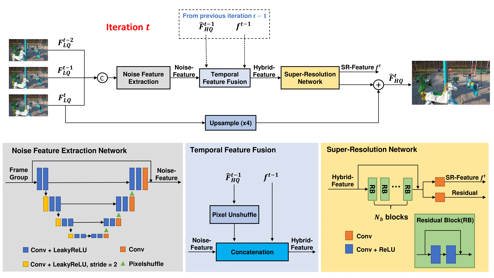
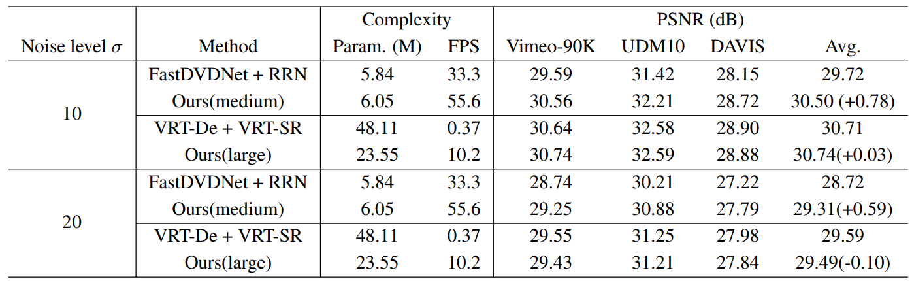

# EVDSRNet.
This is the official implementation of the paper "EFFICIENT JOINT VIDEO DENOISING AND SUPER-RESOLUTION" which is accepted at IEEE ICIP2023. The paper can be officially viewed at [IEEE Xplore](https://www.google.com).

# Overall structure

In this paper, we present two versions of our proposed method, one is noted as medium and another is noted as large. 

The trade-off between the performance and computation cost is parameterized by N_b and N_c where N_b is the number of blocks in the super-resolution network and N_c is the feature dimension of these blocks. 

Our medium model adopts N_b = 8 and N_c = 128 where large model adopts N_b = 16 and N_c = 256.

Besides, our method operates in a non-blind manner, which means the level of noise is fixed for a specific model. 

We have trained and evaluated our model at two Additive White Gaussian Noise (AWGN) levels: sigma = 10 and sigma = 20.

# Performance

Since there is no joint super-resolution and denoising model for video input at the time when the paper is written. We chose a straightforward solution to set the baseline comparison for our method: Denoise-then-SR.

The denoising methods selected are FastDVDNet and VRT-De, where FastDVDNet is an efficient solution that balances between performance and computation cost and VRT-De is the best method in terms of reconstruction quality at the time.

The super-resolution methods selected are RRN and VRT-SR, where RRN is an efficient solution that balances between performance and computation cost and VRT-SR is the best method in terms of reconstruction quality at the time.

For straightforward solutions, we combine FastDVDNet+RRN as an efficient solution and VRT-De+VRT-SR as a quality-favored solution.

Our method presents significant improvement in the trade-off between performance and computation cost compared to straightforward solutions: 
⋅⋅* Unordered sub-list. When compared to the efficient solution, our method achieves better PSNR and faster running speed while maintaining similar model sizes. 
⋅⋅* Unordered sub-list. When compared to the quality-favored solution, our method achieves similar PSNR while running significantly faster and maintaining a much smaller model size.

# Evaluate

# Train

